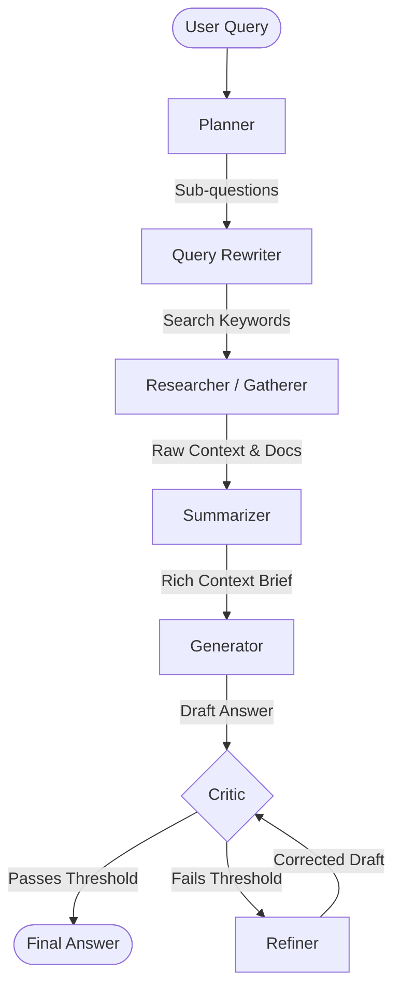

#  AI Research Agent: Autonomous Multi-Agent Research System

> **An advanced, self-healing RAG pipeline that autonomously plans, researches, synthesizes, and refines complex queries into comprehensive answers.**

---

## 📖 Overview

The **Veritas7 AI** is a cutting-edge multi-agent system designed to tackle complex research questions without human intervention. By leveraging the power of **LangGraph**, **Groq**, **FastAPI**, and a **Modern React UI**, this project transforms a simple user prompt into a rigorous, multi-step investigation. 

**The Problem:** Traditional LLM prompts often yield shallow, hallucinated, or unverified answers for deep technical or academic queries. 
**The Solution:** A 7-stage, cyclic graph-based architecture that simulates a team of expert researchers. It breaks down the problem, searches the web, extracts document context, criticizes its own drafts, and iteratively refines the final output until it meets a high-quality threshold—all presented in a beautiful, glassmorphic web interface.


---

## ✨ Key Technical Innovations

- **Agentic Reasoning (LangGraph):** Orchestrates a cyclic, stateful workflow where multiple specialized agents pass information and evaluate each other's work.
- **Self-Healing Loop:** Integrates a designated `Critic` agent that grades generated drafts. If a draft fails the quality threshold, it is sent to a `Refiner` agent iteratively until it passes.
- **Dynamic Context Gathering:** Uses `Tavily` for web search and `BeautifulSoup4` for deep scraping to build up-to-date context, ensuring ground-truth accuracy beyond pre-trained knowledge.
- **Efficient Vector Search:** Implements `ChromaDB` and `SentenceTransformers` for rapid semantic chunking and retrieval of context, optimizing LLM context window limits.

---

## ⚙️ The Workflow: How it Works

The entire pipeline is structured as a directed graph where state flows continuously between nodes.



### The 7 Stages of Research:
1. **Planner (`agents.planner`):** Analyzes the root query and generates logical sub-questions.
2. **Query Rewriter (`agents.query_rewriter`):** Optimizes sub-questions into highly effective search engine keywords.
3. **Researcher (`agents.research_agent`):** Scrapes the web (via Tavily) and vectorizes relevant information.
4. **Summarizer (`agents.summarizer`):** Condenses the massive raw HTML/text into a dense, high-signal context brief.
5. **Generator (`agents.generator`):** Drafts the initial comprehensive answer using the synthesized brief.
6. **Critic (`agents.critic_agent`):** Rigorously evaluates the draft against the original query for accuracy and completeness. Provide a verdict and score.
7. **Refiner (`agents.refiner`):** Iteratively corrects the draft based on the Critic's feedback (only triggers if the draft fails).

---

## 🛠️ Technology Stack

- **Core Frameworks:** Python, LangGraph, LangChain
- **LLM Engine:** Groq API (OpenAI/gpt-OSS-120b)
- **Search & Retrieval:** Tavily API
- **Backend API:** FastAPI, Uvicorn
- **Frontend / UI:** React, Vite, Vanilla CSS 


---

## 📂 Project Structure
```
Veritas7-AI-/
├── agents/             # Specialized node logic
│   ├── planner.py
│   ├── query_writer.py
│   ├── research_agent.py
│   ├── summarizer.py
│   ├── generator.py
│   ├── critic_agent.py
│   └── refiner.py
├── config/             # Settings and Prompts
│   ├── settings.py
│   └── prompts.py
├── core/               # Graph orchestration and State management
│   ├── graph.py
│   └── state.py
├── retrieval/          # Scraping and Web Search
│   └── web_search.py
├── frontend/           # Modern React + Vite UI
│   ├── src/
│   │   ├── components/ # Modular UI components
│   │   ├── App.jsx     
│   │   ├── App.css     
│   │   ├── main.jsx    
│   │   └── index.css   
│   ├── package.json    
│   └── vite.config.js  
├── README.md         
├── requirements.txt   
└── server.py           # FastAPI REST API Entry Poin
```

---

## 🚀 Installation & Setup

Follow these steps to deploy the AI Research Agent locally.

### 1. Clone the Repository

```bash
git clone https://github.com/SPPandey23/Veritas7-AI-.git
cd Veritas7-AI-
```

### 2. Create a Virtual Environment

```bash
python -m venv venv
```

**Activate the virtual environment:**

**Linux / macOS:**

```bash
source venv/bin/activate
```

**Windows:**

```bash
venv\Scripts\activate
```

### 3. Install Backend Dependencies

```bash
pip install -r requirements.txt
```

### 4. Configure API Keys

Create a `.env` file in the root directory:

```env
GROQ_API_KEY="your_groq_api_key_here"
TAVILY_API_KEY="your_tavily_api_key_here"
```

**Get your API keys:**

- [Groq API Key](https://console.groq.com/)
- [Tavily API Key](https://tavily.com/)

> **Note:** Keep your API keys private and never commit your `.env` file to GitHub.

### 5. Run the Application

This project uses a modern decoupled architecture. Run the backend API and frontend UI in two separate terminals.

#### Terminal 1: Start the Backend API

Make sure your virtual environment is activated.

```bash
python server.py
```

#### Terminal 2: Start the Frontend UI

Navigate to the frontend directory:

```bash
cd frontend
```

Install frontend dependencies:

```bash
npm install
```

Start the development server:

```bash
npm run dev
```

### 6. Open the Application

Once both the backend and frontend servers are running, open your browser and visit:

 **[http://localhost:5173](http://localhost:5173)**

Enter a complex question and watch the automated AI researchers go to work! 🤖

